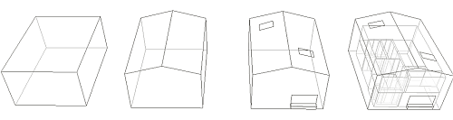
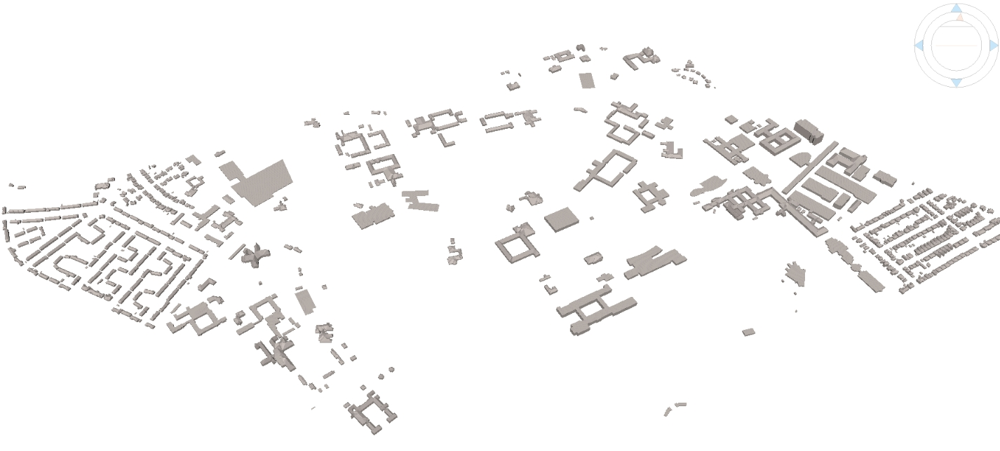

# UK CityGML Buildings

Simple examples of UK building / city models, encoded as CityGML, and created from [OpenStreetMap](https://www.openstreetmap.org/) and [Environment Agency 1m LiDAR](https://data.gov.uk/data/search?theme-primary=Mapping&publisher=environment-agency&res_format=WMS&unpublished=false) data. These models are the result of an automated workflow for creating LOD1 and LOD2 CityGML geometries and therefore have many imperfections. WallSurfaces are based on extrusions of the OSM building footprints. A flat or pitched (assumed) RoofSurface geometry is estimated to create an approximate roof representation. The SRS is EPSG:27700

## University Park, University of Nottingham

This model has 862 buildings with either flat or pitched roofs 
[Download](citygml/university_park.gml)

## Lenton Hurst 

A single building with a procedurally estimated pitched roof.
[Download](citygml/lenton_hurst.gml)

