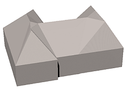

# UK CityGML Buildings

Simple examples of UK building / city models, encoded as CityGML, and created from [OpenStreetMap](https://www.openstreetmap.org/) and [Environment Agency 1m LiDAR](https://data.gov.uk/data/search?theme-primary=Mapping&publisher=environment-agency&res_format=WMS&unpublished=false) data. These models are the result of an automated workflow for creating LOD1 and LOD2 CityGML geometries and do therefore have many imperfections. WallSurfaces are based on extrusions of the OSM building footprints. A flat or pitched (assumed) RoofSurface geometry is estimated to create an approximate roof representation. The SRS of these models is EPSG:27700. 

## University Park, University of Nottingham

This model has 862 buildings with either flat or pitched roofs. OSM buildings found to have a relative height of <3m are excluded from the model. 

[Download CityGML data](/citygml/University_Park.gml)

[View data in Cesium 3D Web Map](https://maptopixel.gitlab.io/3d/osm/) (requires a good browser with WebGL).

## Lenton Hurst 

A single building with a procedurally estimated pitched roof.

[Download CityGML data](/citygml/Lenton_hurst_Aug2017.gml)

